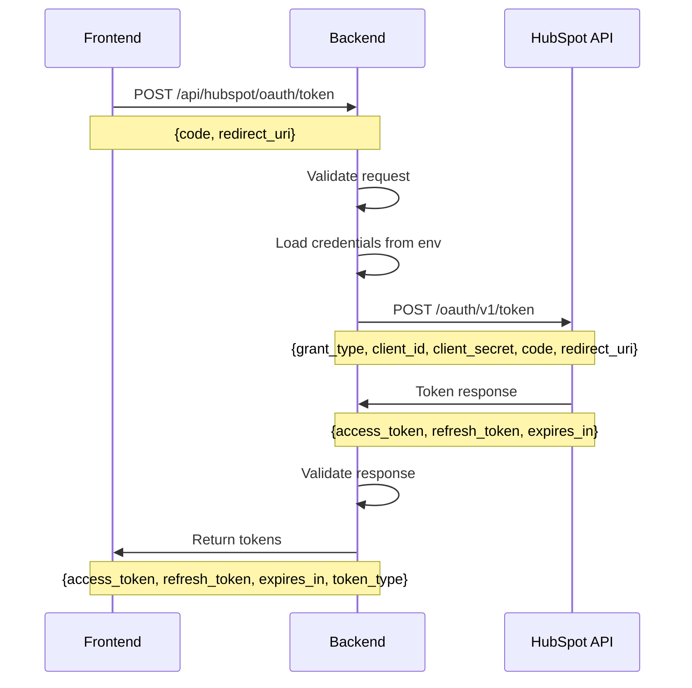

# Design Document

## Overview

The HubSpot OAuth Backend integration provides a secure server-side endpoint for exchanging OAuth authorization codes for access tokens. This design follows OAuth 2.0 best practices by keeping sensitive credentials (client ID and secret) on the server while providing a clean API for the frontend to complete the authentication flow.

The system integrates with the existing FastAPI application structure, leveraging the current patterns for environment variable management, error handling, and CORS configuration.

## Architecture

### High-Level Flow
1. Frontend initiates OAuth flow with HubSpot
2. User authorizes application on HubSpot
3. HubSpot redirects to frontend with authorization code
4. Frontend sends code to our backend endpoint
5. Backend exchanges code for tokens with HubSpot
6. Backend returns tokens to frontend
7. Frontend stores tokens for API calls

### System Components
- **FastAPI Endpoint**: `/api/hubspot/oauth/token` 
- **HubSpot OAuth Client**: HTTP client for token exchange
- **Environment Configuration**: Secure credential management
- **Error Handler**: Comprehensive error processing
- **Request Validator**: Input validation and sanitization

## Components and Interfaces

### 1. OAuth Token Exchange Endpoint

**Endpoint**: `POST /api/hubspot/oauth/token`

**Request Model**:
```python
class HubSpotOAuthRequest(BaseModel):
    code: str = Field(..., description="Authorization code from HubSpot")
    redirect_uri: str = Field(..., description="Redirect URI used in OAuth flow")
```

**Response Model**:
```python
class HubSpotOAuthResponse(BaseModel):
    access_token: str
    refresh_token: str
    expires_in: int
    token_type: str = "bearer"
    scope: Optional[str] = None
```

**Error Response Model**:
```python
class HubSpotOAuthError(BaseModel):
    error: str
    error_description: str
    status_code: int
```

### 2. HubSpot OAuth Client

**Purpose**: Handles HTTP communication with HubSpot's OAuth API

**Key Methods**:
- `exchange_code_for_tokens()`: Primary token exchange function
- `validate_response()`: Response validation and error parsing
- `handle_hubspot_errors()`: HubSpot-specific error handling

**HubSpot OAuth Endpoint**: `https://api.hubapi.com/oauth/v1/token`

**Required Parameters**:
- `grant_type`: "authorization_code"
- `client_id`: From environment variables
- `client_secret`: From environment variables  
- `redirect_uri`: From request
- `code`: From request

### 3. Environment Configuration

**Required Environment Variables**:
```bash
HUBSPOT_CLIENT_ID=your_hubspot_client_id
HUBSPOT_CLIENT_SECRET=your_hubspot_client_secret
```

**Integration with Existing Secrets Management**:
The system will extend the existing secrets.json loading pattern used in `api/main.py`:

```python
# Add to existing secrets loading
os.environ['HUBSPOT_CLIENT_ID'] = secrets.get('hubspot_client_id', '') or secrets.get('HUBSPOT_CLIENT_ID', '')
os.environ['HUBSPOT_CLIENT_SECRET'] = secrets.get('hubspot_client_secret', '') or secrets.get('HUBSPOT_CLIENT_SECRET', '')
```

### 4. Request Validation

**Validation Rules**:
- `code`: Required, non-empty string, max 512 characters
- `redirect_uri`: Required, valid URL format, must match allowed patterns

**Security Validations**:
- Redirect URI whitelist validation
- Input sanitization for XSS prevention
- Rate limiting considerations
- Request size limits

### 5. Error Handling

**Error Categories**:

1. **Client Errors (4xx)**:
   - 400: Invalid request (missing/invalid parameters)
   - 422: Validation errors (malformed data)
   - 429: Rate limit exceeded

2. **Server Errors (5xx)**:
   - 500: Internal server error
   - 503: HubSpot API unavailable
   - 504: Request timeout

3. **HubSpot OAuth Errors**:
   - `invalid_grant`: Authorization code expired/invalid
   - `invalid_client`: Client credentials invalid
   - `invalid_request`: Malformed OAuth request
   - `unsupported_grant_type`: Grant type not supported

## Data Models

### Request/Response Flow



### Database Considerations

**Current Implementation**: No database storage required for this feature. Tokens are returned directly to frontend for client-side storage.

**Future Considerations**: If user association or token persistence is needed, integration with existing database patterns in `database.py` would be straightforward.

## Error Handling

### Error Response Format

All errors follow consistent JSON structure:
```json
{
  "error": "error_code",
  "error_description": "Human readable description",
  "status_code": 400
}
```

### Error Mapping

| HubSpot Error | HTTP Status | Client Action |
|---------------|-------------|---------------|
| `invalid_grant` | 400 | Restart OAuth flow |
| `invalid_client` | 500 | Contact support |
| `invalid_request` | 422 | Fix request format |
| Network timeout | 504 | Retry request |
| Rate limit | 429 | Wait and retry |

### Logging Strategy

**Log Levels**:
- **INFO**: Successful token exchanges
- **WARN**: Client errors (4xx responses)
- **ERROR**: Server errors, HubSpot API failures
- **DEBUG**: Request/response details (excluding sensitive data)

**Security Considerations**:
- Never log access tokens, refresh tokens, or client secrets
- Log request IDs for correlation
- Include timestamp and user context when available

## Testing Strategy

### Unit Tests

1. **Request Validation Tests**:
   - Valid request processing
   - Missing parameter handling
   - Invalid parameter formats
   - Malicious input sanitization

2. **HubSpot Client Tests**:
   - Successful token exchange
   - Various HubSpot error responses
   - Network failure scenarios
   - Response parsing edge cases

3. **Environment Configuration Tests**:
   - Missing environment variables
   - Invalid credential formats
   - Secrets loading integration

### Integration Tests

1. **End-to-End OAuth Flow**:
   - Complete OAuth flow with test credentials
   - Frontend integration testing
   - Error scenario testing

2. **HubSpot API Integration**:
   - Real API calls with test app
   - Rate limiting behavior
   - Error response handling

### Security Tests

1. **Input Validation**:
   - XSS prevention
   - SQL injection prevention (if database integration added)
   - Parameter tampering

2. **Credential Security**:
   - Environment variable isolation
   - Secrets not exposed in logs
   - Error messages don't leak sensitive data

### Performance Tests

1. **Load Testing**:
   - Concurrent token exchange requests
   - Rate limiting behavior
   - Memory usage under load

2. **Timeout Testing**:
   - HubSpot API timeout scenarios
   - Client timeout handling
   - Graceful degradation

## Implementation Notes

### FastAPI Integration

The endpoint will be added to the existing `api/main.py` file following current patterns:
- Use existing CORS middleware configuration
- Follow existing error handling patterns
- Integrate with current logging setup
- Use existing HTTP client patterns (httpx)

### Security Best Practices

1. **Credential Management**:
   - Environment variables only
   - No hardcoded secrets
   - Separate dev/prod credentials

2. **Request Security**:
   - Input validation and sanitization
   - HTTPS enforcement (deployment concern)
   - Rate limiting (future enhancement)

3. **Response Security**:
   - No sensitive data in error messages
   - Consistent error response format
   - Appropriate HTTP status codes

### Monitoring and Observability

1. **Metrics to Track**:
   - Token exchange success/failure rates
   - Response times
   - Error distribution
   - Rate limiting hits

2. **Alerting**:
   - High error rates
   - HubSpot API unavailability
   - Credential expiration/invalidity

This design provides a secure, maintainable foundation for HubSpot OAuth integration while following established patterns in the existing codebase.