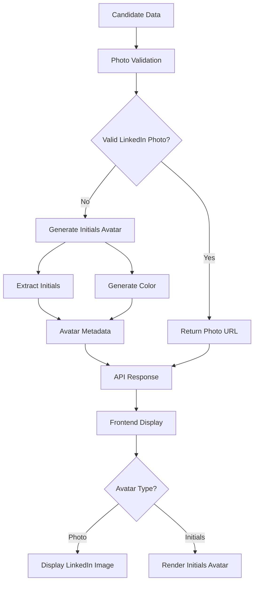

# LinkedIn Photo Initials Fallback Design

## Overview

This design implements an initials-based avatar system that replaces LinkedIn fallback images with personalized circular avatars containing the person's initials. The system enhances the existing photo validation logic to generate deterministic, visually appealing initials avatars when LinkedIn photos are unavailable, providing a more professional user experience while maintaining visual consistency.

## Architecture

The solution extends the current photo validation system with three main components:

1. **Avatar Generation Service**: Creates initials and color schemes based on candidate names
2. **Enhanced API Response**: Includes avatar metadata alongside existing photo validation
3. **Frontend Avatar Renderer**: Displays either LinkedIn photos or generated initials avatars



## Components and Interfaces

### 1. Avatar Generation Service

```python
class AvatarGenerator:
    def generate_initials_avatar(self, first_name: str, last_name: str) -> Dict[str, Any]:
        """
        Generate initials avatar data for a candidate.
        
        Args:
            first_name: Candidate's first name
            last_name: Candidate's last name
            
        Returns:
            Dict containing avatar type, initials, and background color
        """
        
    def extract_initials(self, first_name: str, last_name: str) -> str:
        """Extract initials from candidate names."""
        
    def generate_background_color(self, name: str) -> str:
        """Generate deterministic background color based on name."""
```

### 2. Enhanced Candidate Data Structure

```python
class CandidateAvatar:
    type: str  # "photo" or "initials"
    photo_url: Optional[str]  # LinkedIn photo URL if available
    initials: Optional[str]  # Generated initials for fallback
    background_color: Optional[str]  # Hex color for initials avatar
    
class EnhancedCandidate:
    # Existing fields...
    avatar: CandidateAvatar
    # Backward compatibility
    photo_url: Optional[str]  # Maintained for existing clients
```

### 3. Frontend Avatar Component

```javascript
class AvatarRenderer {
    renderAvatar(candidate) {
        if (candidate.avatar.type === 'photo' && candidate.avatar.photo_url) {
            return this.renderPhotoAvatar(candidate.avatar.photo_url);
        } else if (candidate.avatar.type === 'initials') {
            return this.renderInitialsAvatar(
                candidate.avatar.initials, 
                candidate.avatar.background_color
            );
        }
        return this.renderDefaultAvatar();
    }
    
    renderInitialsAvatar(initials, backgroundColor) {
        // Create circular div with initials
    }
}
```

## Data Models

### Avatar Generation Logic

```python
def generate_initials_avatar(first_name: str, last_name: str) -> Dict[str, Any]:
    """
    Generate initials avatar configuration.
    
    Business Rules:
    - Use first letter of first name + first letter of last name
    - If only one name provided, use first two letters
    - If no name provided, use "?" as fallback
    - Generate deterministic color based on full name hash
    """
    
    # Extract initials
    if first_name and last_name:
        initials = f"{first_name[0].upper()}{last_name[0].upper()}"
    elif first_name:
        initials = first_name[:2].upper()
    elif last_name:
        initials = last_name[:2].upper()
    else:
        initials = "?"
    
    # Generate color
    full_name = f"{first_name or ''} {last_name or ''}".strip()
    background_color = generate_deterministic_color(full_name)
    
    return {
        "type": "initials",
        "photo_url": None,
        "initials": initials,
        "background_color": background_color
    }
```

### Color Generation Algorithm

```python
def generate_deterministic_color(name: str) -> str:
    """
    Generate a deterministic background color based on name.
    
    Uses a predefined palette of professional colors to ensure
    good contrast and visual appeal.
    """
    
    # Professional color palette
    colors = [
        "#3B82F6",  # Blue
        "#10B981",  # Green  
        "#F59E0B",  # Amber
        "#EF4444",  # Red
        "#8B5CF6",  # Purple
        "#06B6D4",  # Cyan
        "#84CC16",  # Lime
        "#F97316",  # Orange
        "#EC4899",  # Pink
        "#6366F1",  # Indigo
    ]
    
    # Generate hash and select color
    name_hash = hash(name.lower().strip())
    color_index = abs(name_hash) % len(colors)
    return colors[color_index]
```

### API Response Format

```json
{
    "candidates": [
        {
            "name": "John Doe",
            "title": "Software Engineer",
            "company": "Tech Corp",
            "avatar": {
                "type": "photo",
                "photo_url": "https://media.licdn.com/dms/image/...",
                "initials": null,
                "background_color": null
            },
            "photo_url": "https://media.licdn.com/dms/image/..."
        },
        {
            "name": "Jane Smith", 
            "title": "Product Manager",
            "company": "Innovation Inc",
            "avatar": {
                "type": "initials",
                "photo_url": null,
                "initials": "JS",
                "background_color": "#3B82F6"
            },
            "photo_url": null
        }
    ]
}
```

## Error Handling

### Avatar Generation Failures

1. **Missing Name Data**: Use "?" as initials with default color
2. **Invalid Characters**: Strip non-alphabetic characters before processing
3. **Empty Names**: Fallback to "?" with neutral gray background
4. **Color Generation Issues**: Use default blue (#3B82F6) as fallback

### Frontend Rendering Failures

1. **LinkedIn Photo Load Error**: Automatically switch to initials avatar
2. **Missing Avatar Data**: Render default "?" avatar
3. **Invalid Color Values**: Use default background color
4. **Rendering Errors**: Show empty circular placeholder

### Backward Compatibility

1. **Legacy API Clients**: Continue receiving `photo_url` field (null for fallback images)
2. **Missing Avatar Object**: Clients should handle gracefully
3. **API Version Compatibility**: New avatar data is additive, not breaking

## Testing Strategy

### Unit Tests

1. **Initials Extraction Logic**
   - Test various name combinations (first+last, single name, empty)
   - Test special characters and unicode handling
   - Test edge cases (very long names, numbers, symbols)

2. **Color Generation**
   - Test deterministic color generation (same input = same output)
   - Test color palette coverage
   - Test hash collision handling

3. **Avatar Object Creation**
   - Test photo vs initials avatar generation
   - Test backward compatibility fields
   - Test error handling and fallbacks

### Integration Tests

1. **API Response Validation**
   - Test enhanced candidate data structure
   - Test backward compatibility with existing clients
   - Test error scenarios (missing data, invalid photos)

2. **Frontend Rendering**
   - Test photo avatar display
   - Test initials avatar rendering
   - Test fallback behavior when photos fail to load
   - Test responsive design and sizing

### End-to-End Tests

1. **Complete User Flow**
   - Test search results with mixed photo/initials avatars
   - Test visual consistency across different screen sizes
   - Test accessibility compliance (color contrast, screen readers)

2. **Performance Testing**
   - Test avatar generation performance with large candidate sets
   - Test frontend rendering performance
   - Test memory usage with many initials avatars

## Implementation Considerations

### Performance Optimization

1. **Caching**: Cache generated avatar data to avoid recomputation
2. **Batch Processing**: Generate avatars for multiple candidates efficiently
3. **Lazy Loading**: Generate initials avatars only when needed

### Accessibility

1. **Color Contrast**: Ensure white text on colored backgrounds meets WCAG standards
2. **Screen Readers**: Provide appropriate alt text for initials avatars
3. **High Contrast Mode**: Support system high contrast preferences

### Mobile Responsiveness

1. **Scalable Avatars**: Use CSS that scales appropriately on different screen sizes
2. **Touch Targets**: Ensure avatars don't interfere with touch interactions
3. **Performance**: Optimize for mobile rendering performance