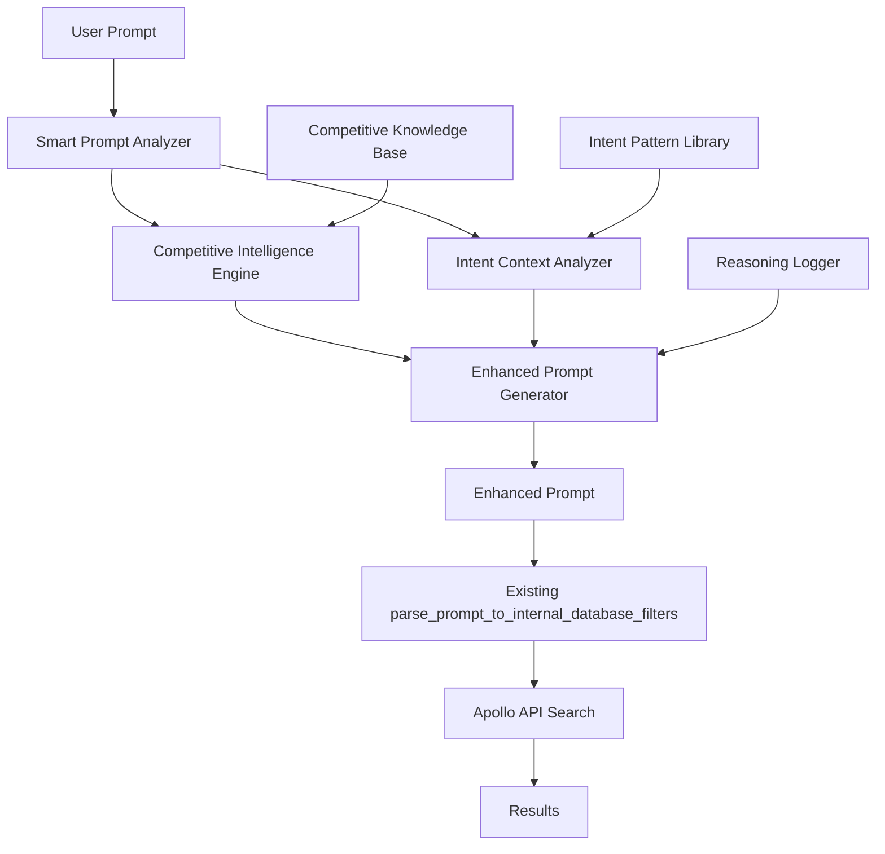

# Design Document

## Overview

The Smart Prompt Interpretation system enhances the existing AI-powered prospect search by adding contextual intelligence and competitive awareness. The system operates as a prompt preprocessing layer that analyzes and enhances user prompts before they reach the existing `parse_prompt_to_internal_database_filters` function, ensuring the current Apollo API integration remains completely unchanged.

The enhancement operates as a prompt enrichment layer that:
1. Analyzes user prompts for competitive relationships and buying intent
2. Maintains a knowledge base of competitive mappings and market intelligence
3. Enhances the original prompt with smart context and exclusion instructions
4. Provides transparent reasoning for prompt modifications
5. Falls back gracefully to passing through the original prompt when needed

## Architecture

### System Components



### Component Details

#### 1. Smart Prompt Analyzer
- **Purpose**: Entry point that orchestrates the enhanced prompt processing
- **Location**: New module `smart_prompt_analyzer.py`
- **Integration**: Replaces direct calls to `parse_prompt_to_internal_database_filters`

#### 2. Competitive Intelligence Engine
- **Purpose**: Identifies competitive relationships and applies exclusion logic
- **Data Source**: Configurable competitive mapping database
- **Key Functions**:
  - Company/product competitive relationship detection
  - Industry category competitive analysis
  - Dynamic competitive exclusion rule application

#### 3. Intent Context Analyzer
- **Purpose**: Understands buying intent and context from user prompts
- **Key Functions**:
  - Buying vs. selling intent detection
  - Role-based filtering (buyers vs. vendors)
  - Use case and pain point identification

#### 4. Enhanced Prompt Generator
- **Purpose**: Combines competitive intelligence and intent analysis to create an enhanced prompt
- **Output**: Modified prompt string with competitive exclusions and context clarifications

#### 5. Competitive Knowledge Base
- **Purpose**: Stores and manages competitive relationship data
- **Format**: JSON-based configuration with update mechanisms
- **Structure**:
  ```json
  {
    "companies": {
      "orum": {
        "category": "sales_dialer",
        "competitors": ["five9", "outreach", "salesloft", "aircall"],
        "aliases": ["orum.com", "orum technologies"]
      }
    },
    "categories": {
      "sales_dialer": {
        "description": "Sales dialing and communication platforms",
        "buying_indicators": ["looking for dialer", "need calling solution"],
        "exclusion_keywords": ["dialer company", "calling platform provider"]
      }
    }
  }
  ```

## Components and Interfaces

### Core Interfaces

#### SmartPromptAnalyzer
```python
class SmartPromptAnalyzer:
    def analyze_prompt(self, prompt: str) -> SmartPromptResult
    def enhance_prompt(self, original_prompt: str, analysis: SmartPromptResult) -> str
```

#### CompetitiveIntelligenceEngine
```python
class CompetitiveIntelligenceEngine:
    def identify_target_products(self, prompt: str) -> List[ProductContext]
    def get_competitors(self, product: str) -> List[str]
    def should_exclude_company(self, company: str, context: ProductContext) -> bool
```

#### IntentContextAnalyzer
```python
class IntentContextAnalyzer:
    def analyze_buying_intent(self, prompt: str) -> BuyingIntentContext
    def identify_buyer_personas(self, prompt: str) -> List[str]
    def extract_use_cases(self, prompt: str) -> List[str]
```

### Data Models

#### SmartPromptResult
```python
@dataclass
class SmartPromptResult:
    original_prompt: str
    detected_products: List[ProductContext]
    buying_intent: BuyingIntentContext
    competitive_exclusions: List[CompetitiveExclusion]
    enhanced_keywords: List[str]
    confidence_score: float
    reasoning: List[str]
```

#### ProductContext
```python
@dataclass
class ProductContext:
    name: str
    category: str
    competitors: List[str]
    buying_indicators: List[str]
    confidence: float
```

#### BuyingIntentContext
```python
@dataclass
class BuyingIntentContext:
    intent_type: str  # "buying", "selling", "researching", "unknown"
    target_roles: List[str]
    use_cases: List[str]
    pain_points: List[str]
    confidence: float
```

## Data Models

### Enhanced Prompt Structure
The system enhances the original prompt with competitive intelligence and context:

**Original Prompt:**
```
"Find me a sales manager looking to buy a new dialer, like Orum"
```

**Enhanced Prompt:**
```
"Find me a sales manager looking to buy a new dialer solution, like Orum. 
EXCLUDE employees from these competing dialer companies: Five9, Outreach, SalesLoft, Aircall, Dialpad. 
Focus on prospects at companies that would be BUYERS of dialer solutions, not companies that SELL dialer solutions. 
Look for titles like Sales Manager, VP Sales, Sales Director who would have buying authority for sales tools."
```

**Analysis Metadata (for logging/transparency):**
```python
{
    "original_prompt": "Find me a sales manager looking to buy a new dialer, like Orum",
    "enhanced_prompt": "Find me a sales manager looking to buy a new dialer solution...",
    "detected_products": ["Orum"],
    "excluded_competitors": ["Five9", "Outreach", "SalesLoft", "Aircall", "Dialpad"],
    "buying_intent_confidence": 0.85,
    "reasoning_steps": [
        "Detected mention of 'Orum' as target product in sales dialer category",
        "Identified 5 direct competitors to exclude from results",
        "Enhanced prompt to clarify buyer vs vendor distinction",
        "Added specific role targeting for decision makers"
    ]
}
```

### Competitive Knowledge Schema
```json
{
  "version": "1.0",
  "last_updated": "2024-01-15",
  "companies": {
    "orum": {
      "category": "sales_dialer",
      "competitors": ["five9", "outreach", "salesloft", "aircall", "dialpad"],
      "aliases": ["orum.com", "orum technologies"],
      "description": "AI-powered sales dialer and communication platform"
    },
    "salesforce": {
      "category": "crm",
      "competitors": ["hubspot", "pipedrive", "zoho", "microsoft_dynamics"],
      "aliases": ["salesforce.com", "sfdc"],
      "description": "Customer relationship management platform"
    }
  },
  "categories": {
    "sales_dialer": {
      "description": "Sales dialing and communication platforms",
      "buying_indicators": [
        "looking for dialer",
        "need calling solution",
        "want to improve call efficiency",
        "seeking sales communication tool"
      ],
      "exclusion_patterns": [
        "dialer company",
        "calling platform provider",
        "telephony vendor"
      ]
    }
  }
}
```

## Error Handling

### Graceful Degradation Strategy
1. **Smart Analysis Failure**: Fall back to existing prompt processing
2. **Competitive Data Unavailable**: Continue without competitive exclusions
3. **Intent Analysis Error**: Use basic keyword matching
4. **Configuration Issues**: Log warnings and use default behavior

### Error Recovery Mechanisms
```python
def safe_smart_prompt_enhancement(prompt: str) -> str:
    try:
        return smart_prompt_analyzer.enhance_prompt(prompt)
    except CompetitiveDataError:
        logger.warning("Competitive data unavailable, using original prompt")
        return prompt
    except IntentAnalysisError:
        logger.warning("Intent analysis failed, using original prompt")
        return prompt
    except Exception as e:
        logger.error(f"Smart prompt enhancement failed: {e}")
        return prompt  # Always fall back to original prompt
```

## Testing Strategy

### Unit Testing
- **Competitive Intelligence**: Test competitor detection and exclusion logic
- **Intent Analysis**: Validate buying intent classification accuracy
- **Filter Enhancement**: Verify filter generation maintains compatibility
- **Knowledge Base**: Test configuration loading and validation

### Integration Testing
- **End-to-End Flow**: Test complete prompt enhancement to results pipeline
- **Fallback Behavior**: Verify graceful degradation to original prompt
- **Existing System Compatibility**: Ensure no changes to prompt_formatting.py or Apollo integration

### Test Data Sets
```python
test_prompts = [
    {
        "original": "Find me a sales manager looking to buy a new dialer like Orum",
        "expected_enhanced": "Find me a sales manager looking to buy a new dialer solution, like Orum. EXCLUDE employees from these competing dialer companies: Five9, Outreach, SalesLoft...",
        "expected_exclusions": ["Five9", "Outreach", "SalesLoft"],
        "expected_intent": "buying"
    },
    {
        "original": "Looking for CRM administrators who might switch from Salesforce",
        "expected_enhanced": "Looking for CRM administrators who might switch from Salesforce. Focus on prospects at companies currently using OTHER CRM systems...",
        "expected_exclusions": ["Salesforce"],
        "expected_intent": "buying"
    }
]
```

### Performance Testing
- **Response Time**: Ensure smart analysis adds <500ms to processing time
- **Memory Usage**: Monitor memory consumption of knowledge base
- **Concurrent Requests**: Test system under load with multiple simultaneous analyses

## Implementation Phases

### Phase 1: Core Infrastructure
- Implement SmartPromptAnalyzer with basic competitive detection
- Create competitive knowledge base structure
- Add integration point in existing prompt processing flow

### Phase 2: Enhanced Intelligence
- Implement IntentContextAnalyzer for buying intent detection
- Add comprehensive competitive mappings
- Implement reasoning and transparency features

### Phase 3: Advanced Features
- Add dynamic competitive relationship learning
- Implement confidence scoring and validation
- Add administrative interface for knowledge base management

### Phase 4: Optimization
- Performance optimization and caching
- Advanced analytics and monitoring
- Machine learning enhancements for pattern recognition