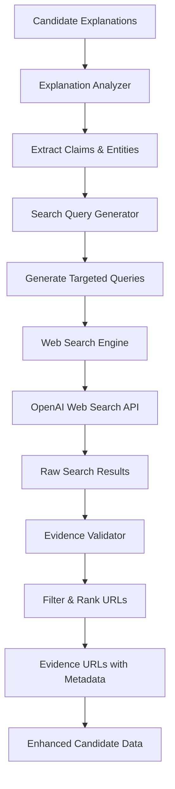

# URL Evidence Finder Design

## Overview

The URL Evidence Finder is a microsystem that analyzes candidate behavioral explanations and uses OpenAI's web search capabilities to find 3-5 specific URLs that support each claim. The system transforms vague behavioral insights into concrete, verifiable evidence by finding relevant company pages, product documentation, news articles, and other authoritative sources that validate the stated prospect behaviors.

## Architecture

The solution consists of four main components working together to process explanations and return evidence URLs:

1. **Explanation Analyzer**: Parses behavioral explanations to extract searchable claims
2. **Search Query Generator**: Creates targeted web search queries from extracted claims  
3. **Web Search Engine**: Uses OpenAI's web search tool to find relevant URLs
4. **Evidence Validator**: Filters and ranks URLs by relevance and quality



## Components and Interfaces

### 1. Explanation Analyzer

```python
class ExplanationAnalyzer:
    def extract_claims(self, explanation: str) -> List[SearchableClaim]:
        """
        Extract searchable claims from behavioral explanations.
        
        Args:
            explanation: Behavioral insight text
            
        Returns:
            List of searchable claims with entities and context
        """
        
    def identify_entities(self, text: str) -> Dict[str, List[str]]:
        """Extract companies, products, and activities from text."""
        
    def categorize_claim(self, claim: str) -> ClaimType:
        """Categorize claim type (company_research, product_evaluation, etc.)."""

class SearchableClaim:
    text: str
    entities: Dict[str, List[str]]  # companies, products, activities
    claim_type: ClaimType
    priority: int  # Higher priority for specific claims
    search_terms: List[str]
```

### 2. Search Query Generator

```python
class SearchQueryGenerator:
    def generate_queries(self, claim: SearchableClaim) -> List[SearchQuery]:
        """
        Generate targeted search queries for a claim.
        
        Args:
            claim: Searchable claim with entities and context
            
        Returns:
            List of optimized search queries
        """
        
    def create_company_query(self, company: str, activity: str) -> str:
        """Create query targeting specific company pages."""
        
    def create_product_query(self, product: str, page_type: str) -> str:
        """Create query for specific product pages (pricing, features, etc.)."""
        
    def create_activity_query(self, activity: str, industry: str) -> str:
        """Create query for general activity research."""

class SearchQuery:
    query: str
    expected_domains: List[str]  # Preferred domains for this query
    page_types: List[str]  # Expected page types (pricing, features, etc.)
    priority: int
```

### 3. Web Search Engine

```python
class WebSearchEngine:
    def __init__(self, openai_client: OpenAI):
        self.client = openai_client
        
    async def search_for_evidence(self, queries: List[SearchQuery]) -> List[SearchResult]:
        """
        Execute web searches using OpenAI's web search tool.
        
        Args:
            queries: List of search queries to execute
            
        Returns:
            List of search results with URLs and metadata
        """
        
    async def execute_search(self, query: SearchQuery) -> SearchResult:
        """Execute single search query with OpenAI web search."""
        
    def parse_search_response(self, response: Any) -> List[URLCandidate]:
        """Parse OpenAI search response into URL candidates."""

class SearchResult:
    query: SearchQuery
    urls: List[URLCandidate]
    citations: List[Citation]
    search_metadata: Dict[str, Any]
```

### 4. Evidence Validator

```python
class EvidenceValidator:
    def validate_and_rank(self, results: List[SearchResult], claim: SearchableClaim) -> List[EvidenceURL]:
        """
        Validate and rank URLs by relevance and quality.
        
        Args:
            results: Raw search results
            claim: Original claim being supported
            
        Returns:
            Ranked list of evidence URLs
        """
        
    def calculate_relevance_score(self, url: URLCandidate, claim: SearchableClaim) -> float:
        """Calculate how well URL supports the claim."""
        
    def validate_url_quality(self, url: URLCandidate) -> bool:
        """Check if URL meets quality standards."""
        
    def categorize_evidence(self, url: URLCandidate) -> EvidenceType:
        """Categorize evidence type (official_page, news, documentation, etc.)."""

class EvidenceURL:
    url: str
    title: str
    description: str
    evidence_type: EvidenceType
    relevance_score: float
    confidence_level: str  # high, medium, low
    supporting_explanation: str
```

## Data Models

### Core Data Structures

```python
from enum import Enum
from typing import List, Dict, Optional
from pydantic import BaseModel

class ClaimType(Enum):
    COMPANY_RESEARCH = "company_research"
    PRODUCT_EVALUATION = "product_evaluation"
    PRICING_RESEARCH = "pricing_research"
    FEATURE_COMPARISON = "feature_comparison"
    VENDOR_EVALUATION = "vendor_evaluation"
    MARKET_RESEARCH = "market_research"
    GENERAL_ACTIVITY = "general_activity"

class EvidenceType(Enum):
    OFFICIAL_COMPANY_PAGE = "official_company_page"
    PRODUCT_PAGE = "product_page"
    PRICING_PAGE = "pricing_page"
    DOCUMENTATION = "documentation"
    NEWS_ARTICLE = "news_article"
    CASE_STUDY = "case_study"
    COMPARISON_SITE = "comparison_site"
    INDUSTRY_REPORT = "industry_report"

class URLCandidate(BaseModel):
    url: str
    title: str
    snippet: str
    domain: str
    page_type: Optional[str]
    
class EvidenceURL(BaseModel):
    url: str
    title: str
    description: str
    evidence_type: EvidenceType
    relevance_score: float
    confidence_level: str
    supporting_explanation: str

class CandidateEvidence(BaseModel):
    candidate_id: str
    original_explanations: List[str]
    evidence_urls: List[EvidenceURL]
    search_metadata: Dict[str, Any]
```

### Enhanced Candidate Response Format

```json
{
    "candidates": [
        {
            "id": 1,
            "name": "John Doe",
            "title": "VP of Sales",
            "company": "TechCorp",
            "reasons": [
                "Currently researching Salesforce pricing options",
                "Actively comparing CRM solutions for enterprise deployment"
            ],
            "evidence_urls": [
                {
                    "url": "https://www.salesforce.com/products/platform/pricing/",
                    "title": "Salesforce Platform Pricing | Salesforce",
                    "description": "Official Salesforce pricing page showing current plans and costs",
                    "evidence_type": "pricing_page",
                    "relevance_score": 0.95,
                    "confidence_level": "high",
                    "supporting_explanation": "Directly supports claim about researching Salesforce pricing options"
                },
                {
                    "url": "https://www.g2.com/categories/crm",
                    "title": "Best CRM Software 2024 | G2",
                    "description": "Comprehensive CRM comparison and reviews",
                    "evidence_type": "comparison_site", 
                    "relevance_score": 0.88,
                    "confidence_level": "high",
                    "supporting_explanation": "Supports claim about comparing CRM solutions"
                }
            ]
        }
    ]
}
```

## Search Strategy Implementation

### Query Generation Strategies

```python
def generate_search_strategies(claim: SearchableClaim) -> List[SearchQuery]:
    """Generate multiple search strategies for comprehensive coverage."""
    
    strategies = []
    
    # Strategy 1: Direct company + activity search
    if claim.entities.get('companies'):
        for company in claim.entities['companies']:
            if claim.entities.get('activities'):
                for activity in claim.entities['activities']:
                    query = f"{company} {activity} site:{get_company_domain(company)}"
                    strategies.append(SearchQuery(
                        query=query,
                        expected_domains=[get_company_domain(company)],
                        priority=10
                    ))
    
    # Strategy 2: Product-specific searches
    if claim.entities.get('products'):
        for product in claim.entities['products']:
            if 'pricing' in claim.text.lower():
                query = f"{product} pricing cost plans"
                strategies.append(SearchQuery(
                    query=query,
                    page_types=['pricing'],
                    priority=9
                ))
    
    # Strategy 3: General activity searches
    if claim.claim_type == ClaimType.GENERAL_ACTIVITY:
        activity_terms = extract_activity_terms(claim.text)
        query = f"{' '.join(activity_terms)} comparison evaluation"
        strategies.append(SearchQuery(
            query=query,
            page_types=['comparison', 'review'],
            priority=7
        ))
    
    return strategies
```

### URL Quality Scoring

```python
def calculate_quality_score(url_candidate: URLCandidate, claim: SearchableClaim) -> float:
    """Calculate comprehensive quality score for URL."""
    
    score = 0.0
    
    # Domain authority (official company sites get highest scores)
    if is_official_company_domain(url_candidate.domain, claim.entities.get('companies', [])):
        score += 0.4
    elif is_authoritative_domain(url_candidate.domain):
        score += 0.3
    elif is_reputable_domain(url_candidate.domain):
        score += 0.2
    
    # Page type relevance
    page_type = detect_page_type(url_candidate.url, url_candidate.title)
    if page_type in get_expected_page_types(claim):
        score += 0.3
    
    # Content relevance (title and snippet matching)
    content_relevance = calculate_content_match(
        url_candidate.title + " " + url_candidate.snippet,
        claim.search_terms
    )
    score += content_relevance * 0.3
    
    return min(score, 1.0)
```

## Error Handling and Fallbacks

### Search Failure Handling

1. **API Timeout**: Implement 30-second timeout with graceful degradation
2. **No Results Found**: Try alternative search strategies with broader terms
3. **Low Quality Results**: Expand search to include secondary sources
4. **Rate Limiting**: Implement exponential backoff and request queuing

### Quality Assurance

```python
class QualityAssurance:
    def validate_evidence_set(self, evidence_urls: List[EvidenceURL]) -> bool:
        """Ensure evidence set meets minimum quality standards."""
        
        # Must have at least 2 URLs with confidence > 0.7
        high_confidence = [url for url in evidence_urls if url.relevance_score > 0.7]
        if len(high_confidence) < 2:
            return False
            
        # Must have at least one official or authoritative source
        authoritative = [url for url in evidence_urls 
                        if url.evidence_type in [EvidenceType.OFFICIAL_COMPANY_PAGE, 
                                               EvidenceType.PRODUCT_PAGE]]
        if len(authoritative) < 1:
            return False
            
        return True
```

## Performance Considerations

### Optimization Strategies

1. **Parallel Processing**: Execute multiple searches concurrently
2. **Caching**: Cache search results for common queries
3. **Batch Processing**: Process multiple candidates efficiently
4. **Smart Querying**: Limit searches to most promising strategies first

### Performance Targets

- **Response Time**: < 5 seconds for 3 candidates
- **Success Rate**: > 90% of candidates get at least 2 quality URLs
- **Accuracy**: > 85% of URLs directly support stated claims
- **Throughput**: Handle 50+ candidates per minute

## Integration Points

### API Integration

```python
@app.post("/api/candidates/enhance-evidence")
async def enhance_candidates_with_evidence(candidates: List[Dict]) -> Dict:
    """
    Enhance candidate data with evidence URLs.
    
    Args:
        candidates: List of candidate objects with explanations
        
    Returns:
        Enhanced candidates with evidence_urls field
    """
    
    evidence_finder = URLEvidenceFinder()
    enhanced_candidates = []
    
    for candidate in candidates:
        try:
            evidence = await evidence_finder.find_evidence(
                explanations=candidate.get('reasons', []),
                candidate_context=candidate
            )
            candidate['evidence_urls'] = evidence
        except Exception as e:
            # Log error but don't fail the entire request
            candidate['evidence_urls'] = []
            
        enhanced_candidates.append(candidate)
    
    return {"candidates": enhanced_candidates}
```

### Backward Compatibility

- New `evidence_urls` field is additive, doesn't modify existing fields
- Graceful degradation when evidence finder is unavailable
- Optional feature that can be enabled/disabled per request